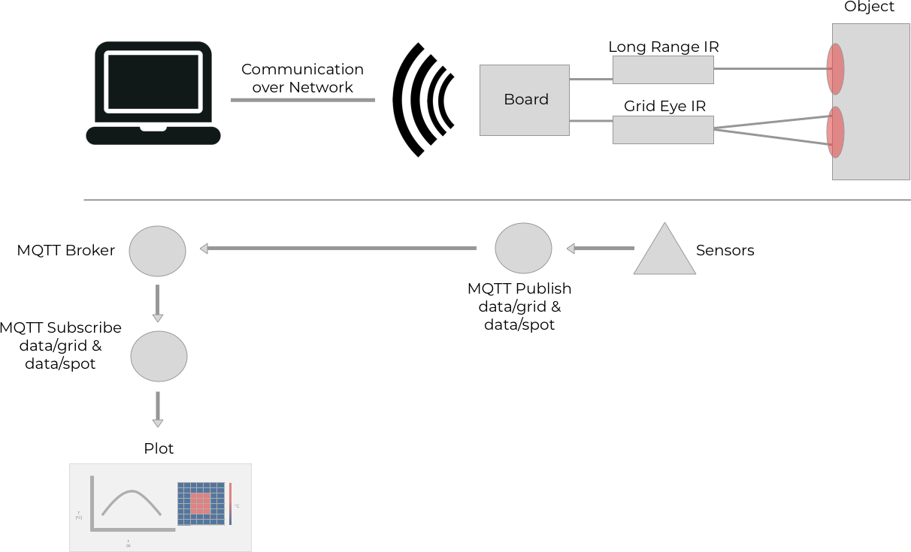

Demonstration Application Guide
===============================

Overview
--------
This guide covers the technical details of the demonstration application for the long-range temperature sensor.

The demonstration application has two major components:
    `Target Application`
        This runs on your Forward Loop Zero to measure the temperature of an object using two different infrared cameras and then publish that data to an MQTT broker
    `Host Application`
        This runs on your host machine to start an MQTT broker, a publish service that sends a heartbeat to the broker, and a subscribe service that reads the temperature data from the target and plots the data in realtime
   
Preqrequisites
--------------
Check out the `Forward Loop Zero Setup Guide <https://docs.forward-loop.com/forward-loop-zero/intro/setup.html>`_ for information on how to configure wifi, SSH, and optional hardware with your Forward Loop Zero.

To run the host application, you will need to install Docker Compose on your local machine. See the official `Docker Compose Installation Instructions <https://docs.docker.com/compose/install/>`_ for more information.

Run the Target Application
--------------------------
To run the target application, you will push the target application code to your sensor and then run the application in order to pass temperature data over the network. 

To begin, you need to connect your long-range temperature sensor to a Wi-Fi network and determine the local IP address of your sensor. See the  `Forward Loop Zero Setup Guide <https://docs.forward-loop.com/forward-loop-zero/intro/setup.html>`_ for more information.

Once your sensor is connected to the network, there are several options for how to run the target application.

.. tabs::

    .. tab:: Using floop

        Forward Loop supports all Forward Loop Zero sensors using `floop <https://docs.forward-loop.com/floopcli/master/index.html>`_, a simple command-line interface for running embedded Docker applications on a wide range of devices.

        To get started using floop with your long-range temperature sensor, install floop on your host machine:

        .. code-block:: bash

            pip install --upgrade floopcli

        On your host machine, clone the demonstration application:

        .. code-block:: bash

            git clone --recursive \
            https://github.com/ForwardLoopLLC/long-range-temperature-sensor

        You will need to clone the repository recursively in order to download the necessary dependencies for hardware communication.

        To make sure that the target application publishes data to the correct MQTT broker address, you will need to edit the file **long-range-temperature-sensor/target/network.env**:

        .. literalinclude:: ../../../target/network.env

        Make sure to change the *MQTT_HOST* variable to the IP address of your host. 

        In order to use floop with your long-range temperature sensor, you can use the **floop.json.example** in the application repository as a template for your floop configuration. For further information on configuring floop, see the `floop Configuration Guide <https://docs.forward-loop.com/floopcli/master/intro/hello.html#configure-the-app-with-floop>`_.

        Once floop is configured for your Forward Loop Zero and network set-up, you can run the demonstration application from the **long-range-temperature-sensor** directory:

        .. code-block:: bash

            floop run -v

        This will push the application code from your host to your Forward Loop Zero, build the application code, and start running the target application.

    .. tab:: Using Docker

        If you prefer to work directly on your Forward Loop Zero, then you can run the target application using Docker on the target device. 
        
        If you are using the operating system image that came with your Forward Loop Zero, then Docker should already be installed on your Forward Loop Zero. Otherwise, see the `Official Docker Installation Guide <https://docs.docker.com/install/linux/docker-ce/ubuntu/#set-up-the-repository>`_ and follow the instructions for the `armhf` architecture.

        Log into your Forward Loop Zero via SSH. For more information on configuring SSH, see the `Forward Loop Zero Setup Guide <https://docs.forward-loop.com/forward-loop-zero/intro/setup.html>`_.

        Once you SSH into your Forward Loop Zero as the **floop** user, you should be in the **/home/floop/** directory.

        On your Forward Loop Zero, clone the demonstration application:

        .. code-block:: bash

            git clone --recursive \
            https://github.com/ForwardLoopLLC/long-range-temperature-sensor

        You will need to clone the repository recursively in order to download the necessary dependencies for hardware communication.

        To make sure that the target application publishes data to the correct MQTT broker address, you will need to edit the file **long-range-temperature-sensor/target/network.env**:

        .. literalinclude:: ../../../target/network.env

        Make sure to change the *MQTT_HOST* variable to the IP address of your host. 

        Change to the **target** directory and build the Docker image:

        .. code-block:: bash

            cd /home/floop/long-range-temperature-sensor/target && \
            docker build -f Dockerfile.linux -t floop .

        Run the Docker image as a container with links to the target application code, privileged access enabled, and access to the operating system Docker socket:

        .. code-block:: bash

            docker run \
            --name floop \
            -v /home/floop/long-range-temperature-sensor/:/floop/ \
            --privileged \
            -v /var/run/docker.sock:/var/run/docker.sock \
            floop

Your Forward Loop Zero is now reading temperature data from both the long-range and grid-eye infrared sensors and publishing that data via MQTT.

In order to read and visualize that data, you will need to run the host application. 

Run the Host Application
------------------------
To run the host application, you will start an MQTT broker, subscribe to the temperature data topics on that broker, and plot the temperature data in realtime.

In order to see the plots on your local machine, you may need temporarily to add Docker to the list of xhost sources:

.. code-block:: bash

    xhost +local:docker

To run the MQTT broker and plots, you can use the deployment script in the **long-range-temperature-sensor** directory:

.. code-block:: bash

    ./plot.sh

This will bring up the MQTT broker on your host machine, subscribe to the temperature data topics, and display the realtime plots.

Further Information
-------------------
:doc:`custom`
    Modify the demonstration application to use your own application code on the target and the host
